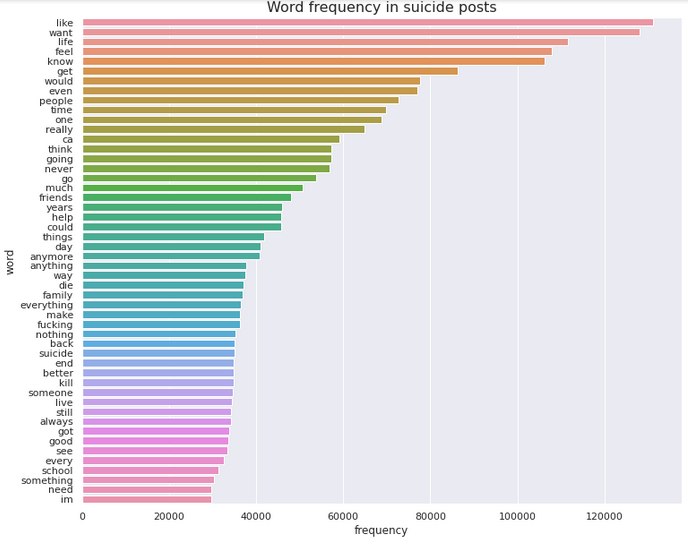
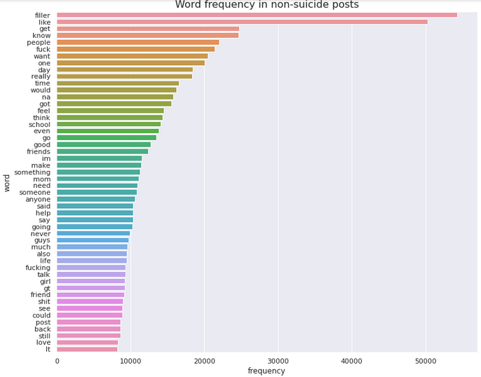

# NLP text and audio analysis to potentially identify depression

## Scope

Group final project of the NLP course. The purpose of this project is to attempt to
identify if a user shows signs of depression by analysing a piece of text or audio.
The nature of the topic makes it very difficult to come to a conclusion with high
certainty, so the scope limits itself to be a tool of potantial identification.


## Dataset

In order to accomplish this task we used a dataset scraped from subreddits, where posts are 
labeled as being potentially suicidal or non-suicidal. Some things to note are: this an extreme
case of our original aim, it's not necessarily linked with depression, and all cases are self
reported. The dataset can be found in [Kaggle][1].

### Download

To download the dataset you'll need a Kaggle account. This process can be done through the
cli, which requires a couple of extra steps if the API access is not already setup:

- Install the python package with `pip3 install kaggle`
- Go to the Account section of your Kaggle profile
- Select 'Create API Token', this will download a `kaggle.json` file that contains your token
- Move the `kaggle.json` file to the `~/.kaggle/` directory
- Check the functionality with `kaggle --version` or `poetry run kaggle --version`
- If you are using the API from Google Colab you can use the following snippet

```python
# from: https://colab.research.google.com/github/corrieann/kaggle/blob/master/kaggle_api_in_colab.ipynb
from google.colab import files

uploaded = files.upload()

for fn in uploaded.keys():
  print('User uploaded file "{name}" with length {length} bytes'.format(
      name=fn, length=len(uploaded[fn])))
  
# Then move kaggle.json into the folder where the API expects to find it.
!mkdir -p ~/.kaggle/ && mv kaggle.json ~/.kaggle/ && chmod 600 ~/.kaggle/kaggle.json
```
Once you have the API working, you can download and unzip the dataset with:

- `kaggle datasets download -d nikhileswarkomati/suicide-watch -p data/depression`
- `unzip data/depression/suicide-watch.zip -d data/depression`

### Exploration

All the preprocessing and visualization can be found on `notebooks/preprocessing_visualization.ipynb`.
It's a notebook that ran in Colab, so the results should be easily reproduced.

As stated, the labels contained within the dataset are 'suicide', and 'non-suicide'. The
class distribution is almost perfectly balanced, with each example having almost 120,000 entries.


Among the suicidal posts the most commonly used words appear to be related to desires, people,
feelings, and time. The non-suicidal posts appear to use more convertational words not related
to anything in particular, the only recurrent topic is school related. 




Another thing to note is the average length of words per datapoint. After removing stopwords
and punctuation, the average length of a suicide-related text is 236.28 words, compared to 
70.85 from a non-suicide text. This is expected, due to the serious nature of the topic,
and need for expression.

### Noisy label correction

The main preprocessing experiment done is attempting to remove some of the noise in the labels.
Due to the way the dataset was obtained, the accuracy of the labels is put into question. Not 
only because it's self repoted by users, but mainly as a result of web scraping. Posts under
a subreddit aren't necessarily about that subreddit, moderators' messages, off-topic conversation,
etc. This is why we tried the approach used by [Haque, Reddi, and Giallanza][2], where they
used a simple, but effective unsupervised method for noisy label correction.

The method can be summarized as follows:

1. Remove oddities from the dataset
  - Removed posts/comments, user and subreddit mentions, urls, emojis, etc.
2. Embedd each text into an n-dimensional space
  - We used [Google's universal-sentence-encoder][3]
3. Reduce the space dimensionality to aid with clustering performance
  - We used [UMAP: Uniform Manifold Approximation and Projection][4]
4. Use a clustering algorithm to find k class clusters
  - We used [K-Means clustering][5]
5. Compute the distance of every point to all clusters to get a soft 'confidence' score
6. Re-label the points with confidence >= 0.9, keep the same otherwise

This method resulted in 11.56% of our data being re-labeled. The idea is to train a baseline
model with traditional processing and another one with noisy label correction to see the
effect in performance.


## Training

Models were trained using [Huggingface][6] [transformers][7] library. The google Colab notebook
can be found under `notebooks/model_training.ipynb`. The models were fine-tuned using a pre-trained
version of [Google's BERT][8]. As mentioned in the previous section, one model was trained with
traditional text processing, and another one with noisy label correction applied, as well as
some basic reddit specific noise removed. The weights of both models are currently being hosted
on Google Drive for easier access with `!gdown` in a Google Colab session.


## Inference

Inference can be done via the `src.inference` script. To use it simply call:

`python3 -m src.inference --demo`

The possible flags are:
- --demo: Predict the sentiment of a fixed, predefined set of sentences.
- --input: Predict over a user-given sentences. The sentences should be given 
  as a string argument, where sentences are separated by the set of characters '&&' e.g. 
  'this is sentence one&&Sentence two'".
- --voice: Use a voice recognition model to perform inference over an audio transcription. 
  If the 'record' string is given as an argument, it will prompt for a recording, otherwise 
  provide the path to the audio file as an argument.
- --data\_path: Base path to the directory where all the pretrained models are stored, default=data/.

This information can be seen at any point by using the `--help` flag.


[1]: https://www.kaggle.com/nikhileswarkomati/suicide-watch
[2]: https://arxiv.org/abs/2102.09427
[3]: https://tfhub.dev/google/universal-sentence-encoder/4
[4]: https://umap-learn.readthedocs.io/en/latest/
[5]: https://scikit-learn.org/stable/modules/generated/sklearn.cluster.KMeans.html
[6]: https://huggingface.co/
[7]: https://github.com/huggingface/transformers
[8]: https://arxiv.org/abs/1810.04805


